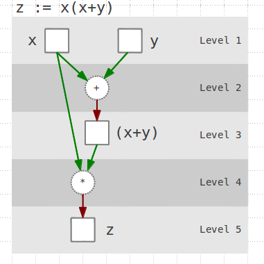

# reactnet

Consistent value propagation through a network of reactives.

[](https://travis-ci.org/friemen/reactnet)

The goal is a core for a reactive library that is designed to avoid
inconsistencies and bouncing effects and gracefully handles infinite
loops caused by cyclic dependencies.

It will be the core of a [reactor](https://github.com/friemen/reactor)
re-implementation.

[API docs](https://friemen.github.com/reactnet)

## Introduction

This library is a low-level tool for creating combinators that follow
[FRP](http://en.wikipedia.org/wiki/Functional_reactive_programming)
ideas.

To illustrate how reactnet can be used we take three steps:
* Provide functions that conveniently define links.
* Define the network itself, consisting of reactives and links between them.
* Use the network by pushing values to it.

For a complete overview please see the
[example](https://github.com/friemen/reactnet/blob/master/src/reactnet/example.clj).

### Links
A *network* is solely defined by a set of links that refer to reactives.

A *reactive* is a thing that takes/returns values, *eventstreams* and
*behaviors* are concrete implementations of the `IReactive` protocol.

A *link* connects input with output reactives through a
*link-function*, in addition it carries an error handler, a handler
called upon completion of any input reactive and some other
settings.

Defining links is the crucial part. This is what the common FRP
combinators like `map`, `filter`, `switch` etc. are all about: they
add or remove links to a network.

Here's a first example. 

```clojure
(defn apply-fn-link
  "Applies a function to input-reactives and passes the value to one
  output reactive."
  [f input-reactives output-reactive]
  (rn/make-link (str f) input-reactives [output-reactive]
                :link-fn
                (fn [{:keys [input-rvts output-reactives] :as input}]
                  (let [vs     (map rn/value input-rvts)
                        result (apply f vs)]
                    {:output-rvts (rn/broadcast-value result output-reactives)}))))
```

The function above returns a new link, that applies a function f to
values found in input reactives. The result of the function
application is returned as value of the output reactives. This is - in
essence - already a *function lifting* implementation. It takes an
ordinary function and lifts it to work on reactives instead of plain
values.

Here's a second example, showing how a subscription to a single
reactive is implemented. The function f is applied to the first value
of the inputs. Any result is ignored.

```clojure
(defn subscribe-link
  "Subscribes a fn to one reactive."
  [f input-reactive]
  (rn/make-link "subscribe" [input-reactive] []
                :link-fn
                (fn [{:keys [input-rvts] :as input}]
                  (f (rn/fvalue input-rvts))
                  {})))
```

As you can see a link-function receives a map and returns a map, which
in both cases is a Result map, for details see the Concepts section
below.

To make the network act dynamically with respect to the values flowing
through it, the link-functions must also be able to add or remove
links. (The code above does not demonstrate this.)


### The network

To actually create a network the following suffices:
```clojure
(def n (refs/agent-netref
        (rn/make-network "sample1" [])))
```

The var `n` now contains a thin wrapper around a Clojure agent. This
is necessary to support other execution models, for example based on
an atom (for unit testing) or on core.async channels and go-blocks.

Please note that an agent-based network reference executes propagation
and updates asynchronously (on a different thread). Therefore changes
do not become immediately visible on the thread that triggered an
update. The benefit is more consistency, as alls propagations and
updates are processed sequentially in the order they were
enqueued. Another benefit is that the network propagation can deal
with cycles in the dependency graph. Since links and reactives are
ordered topologically the algorithm can sort upstream updates out and
push them into the queue, postponing them for a later propagation
cycle.

Although propapation is confined to one thread it is possible to use
link-functions that work asynchronously on different threads to avoid
blocking the propagation. Their results are simply enqueued as if they
were external stimuli. This means we can make trade-offs between
consistency and responsiveness at the granularity of specific links.


Let's define some reactives. *Behaviors* are time-varying values, in
other words variables that can be observed. They always have a
value. This is the main difference to *Eventstreams* which can be seen
as sequences of value/timestamp pairs. Once a value is consumed it's
gone.

We stick to Behaviors. Here we create four of them, which are -
despite their names - until now totally independent of each other:

```clojure
(def x   (rs/behavior "x" 1))
(def y   (rs/behavior "y" 2))
(def x+y (rs/behavior "x+y" nil))
(def z   (rs/behavior "z" nil))
```

To collect updates to z we use a Clojure atom:

```clojure
(def zs (atom []))
```

So far, none of these things is connected to a network. We change
this by adding links that reference input and output reactives.

```clojure
(rn/add-links! n
               (apply-fn-link + [x y] x+y)
               (apply-fn-link * [x+y x] z)
               (subscribe-link (partial swap! zs conj) z))
```

Ignoring `zs` we just created something looking like this:



The network is now setup, we can inspect it like so ...

```clojure
(rn/pp n)
; Reactives
;   x+y:3
;   x:1
;   z:3
;   y:2
; Links
;  L2 [x y] -- clojure.core$_PLUS_@2039adf7 --> [x+y] READY
;  L4 [x+y x] -- clojure.core$_STAR_@2acc43a8 --> [z] READY
;  L6 [z] -- subscribe --> [] READY
;= nil
```

... and `zs` already contains the first update to `z`.

```clojure
@zs
;= [3]
```


### Using it

Let's update `x`

```clojure
(rn/push! n x 4)
```

If we deref `zs` then we find `[3 24]`. As you can see, although
changes to `x` cause two links to be re-evaluated (the `+` and the
`*`), only one update of the result `zs` happens.

This property is critical for example in case updates to a behavior
cause side-effects.

### And now?

Obviously, the API shown so far is too clumsy to be used to formulate
complex reactive solutions. The following sections will explain how to
use reactnet to create a nice API.

## Concepts

Before explaining how to provide functionality that is nice to use you
will need to grasp some terminology. The following concepts form the
foundation of this library.

### Reactive

A reactive is something that takes and provides values, basically an
abstraction from classical FRP concepts *behavior* and
*events(tream)*. The following protocol shows what the propagation
algorithm expects:

```clojure
(defprotocol IReactive
  (last-value [r]
    "Returns latest value of the reactive r.")
  (available? [r]
    "Returns true if the reactive r would provide a value upon consume!.")
  (pending? [r]
    "Returns true if r contains values that wait for being consumed.")
  (completed? [r]
    "Returns true if the reactive r will neither accept nor return a new value.")
  (consume! [r]
    "Returns current value of reactive r and may turn the state into unavailable.")
  (deliver! [r value-timestamp-pair]
    "Sets/adds a pair of value and timestamp to r, returns true if a
  propagation of the value should be triggered."))
```

### Link
A map connecting input and output reactives via a function.
```
  :label               Label for pretty printing
  :inputs              Input reactives
  :outputs             Output reactives, each wrapped in WeakReference
  :link-fn             A link function [Result -> Result] (see below)
  :error-fn            An error handling function [Result -> Result] (see below)
  :complete-fn         A function [Link Reactive -> Result] called when one of the
                       input reactives becomes completed
  :complete-on-remove  A seq of reactives to be completed when this link is removed
  :level               The level within the reactive network
                       (max level of all input reactives + 1)
```
Reactives are known to the network solely by links referencing them.

### Link function
 A function [Result -> Result] that takes a Result map containing
 input values and returns a Result map or nil, which denotes that
 the function gives no clue if its invocation changed any reactive.

### Error handling function
 A function [Result -> Result] that takes the Result containing an
 exception. It may return a new Result map (see below) or nil.

### Complete function
 A function [Link Reactive -> Result] that is called for each input
 reactive whose completion is detected. It may return a Result map
 (see below) or nil.

### RVT
 A nested pair `[r [v t]]` representing a value `v` assigned to the
 Reactive `r` at time `t`.

### Result
A map passed into / returned by the link-fn, error-fn and complete-fn
with the following entries
```
  :input-reactives     The links input reactives
  :output-reactives    The links output reactives
  :input-rvts          A seq of RVTs
  :output-rvts         A seq of RVTs
  :exception           Exception, or nil if output-rvts is valid
  :add                 A seq of links to be added to the network
  :remove-by           A predicate that matches links to be removed
                       from the network
```
This map is the vehicle for data exchange between functions attached
to links and the propagation / update algorithm.


### Network
A map containing the following entries
```
  :id                  A string containing an identifier
  :links               Collection of links
  :rid-map             WeakHashMap {Reactive -> rid} (derived)
  :level-map           Map {rid -> topological-level} (derived)
  :links-map           Map {rid -> Seq of links} (derived)
```
`rid` is a reactive identifier, an integer which is unique within a network.


### Network Reference
Serves as abstraction of how the network is stored and
propagation/updates to it are enqueued.

```clojure
(defprotocol INetworkRef
  (update [netref f args]
    "Apply f to the current network state (as first arg) and the
    arguments given in the args vector.")
  (network [netref]
    "Return the network state."))
```

## Creating links

A network is made up of links. Most FRP-style combinators are
essentially factories that create new reactives and link them via
specific functionality to other reactives. For any link you must
decide

* On which input and output reactives does it operate?
* How are output values computed from input values? Put it into
  the link function of type [Result -> Result].
* What should happen in case the link function throws an exception?
  The answer is encoded into the error handler, again of type
  [Result -> Result].
* What happens if one of the input reactives becomes completed? This
  is implemented as complete function of type
  [Link Reactive -> Result].
* Which reactives shall be set to completed when the link is removed
  from the network?

All of this information can be passed to `make-link` which in turn
creates a Link map.

Creating the three functions boils down to handling the Result map
properly.

TODO
* Explain RVTs / getting values / returning values
* Explain add/remove links
* Explain how exceptions are treated


## How it works

TODO Give some more background on

* Topological levels
* WeakReferences for outputs
* Automatic link removal / completion
* Backpressure


### The propagation / network update algorithm

The `propagate!` function is the heart of the algorithm, and it works
recursively. The recursion depth depends on the topological height of
the network. It is usually invoked in the form of `(propagate! network
pending-links pending-reactives)`, taking three args: the network, any
links from a prior call to it that weren't evaluated so far, and any
reactives that are known to have pending values.

Steps:

* Collect links that must be evaluated because they're either pending
  or have an input reactive that is contained in the
  pending-reactives.
* Of the pending links take only those that are on the minimum
  topological level and are actually ready to be evaluated.
* Consume all input reactive values of the links that are going to be
  evaluated.
* Evaluate all links on the same topological level, and collect
  results.
* Look for completed reactives, invoke corresponding link
  complete-fns, and collect the results.
* Update the network from the results, which basically means add /
  remove links. An update causes re-calculation of the topological
  level assignment of links and reactives.
* Push all upstream values contained in results, so they get enqueued
  for another propagation cycle, they will not be delivered/handled in
  this cycle.
* Deliver downstream values contained in results to reactives and
  recursively invoke `propagate!` for all values.

After `propagate!` exits the outermost invocation a loop starts that
checks if there are still pending reactives. If yes, another
propagation cycle is started right-away. However, it is possible that
no link is ready to be evaluated, leading to no new results. In this
case the loop is terminated.


## License

Copyright 2014 F.Riemenschneider

Distributed under the Eclipse Public License 1.0.
